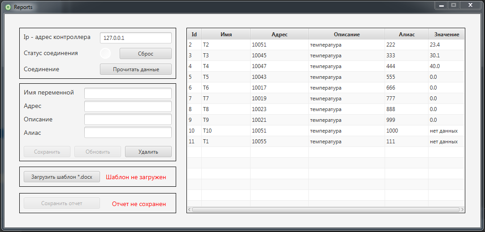

## Приложение ModBus reports

### Описание

Приложение для чтения данные с ПЛК по modbus протоколу, с последующем сохранением полученного 
результата в файл формата *.docx. Для работы приложения необходимы Java SE Development Kit 20.0.1(jdk-20) 
и файл шаблон *.docx. В файле нужно указать символы, которые необходимо заменить на полученные значения по
протоколу modbus tcp. 
После запуска приложения заполнить таблицу необходимыми данными. В поле "Алиас" указать символы, которые 
требуется заменить на значения типа real, полученные с ПЛК. Нажать кнопку "прочитать данные", в полях 
"значения" появятся полученные данные.
Загрузить файл-шаблон docx и сохранить отчет.

### Используемые инструменты:
1. [x] Java FX;
2. [x] Maven:
   * JLibModbus;
   * Jackson core;
   * Apache POI.
  
### Запуск
Воспользуйтесь установщиком.

Последняя версия приложения доступна в разделе [релизы](https://github.com/kollince/ModbusReport/releases).

